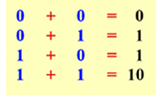

# Code Challenge 

## Problem Statement
Given 2 strings that contains a binary number (only 0 or 1)
Create a program that add 2 binary numbers and print the result. 

## Binary Addition Process

The addition process is given by 4 possible combinations:

## Task to take offline

1. Improve Code Commenting
2. Add / name Test Cases
3. Add feature to handle different lenght input string (lenght missmatch)
4. Boundary Conditions